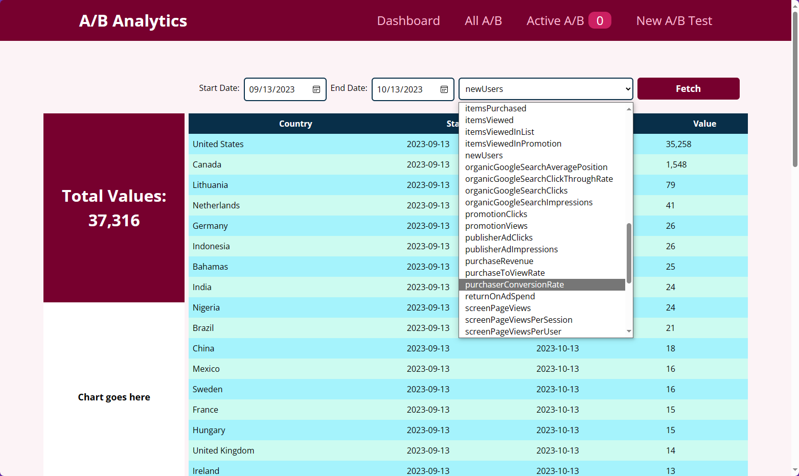
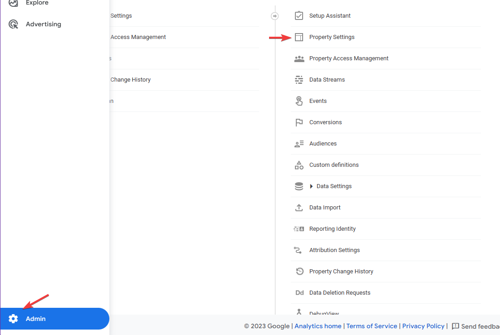
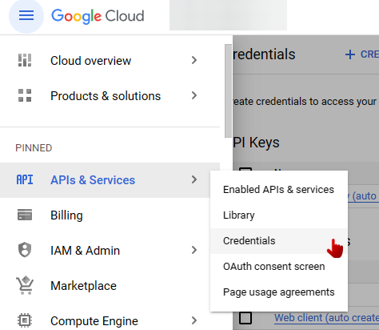
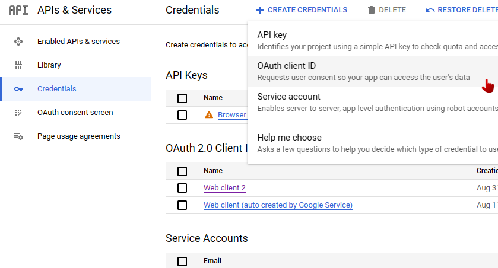
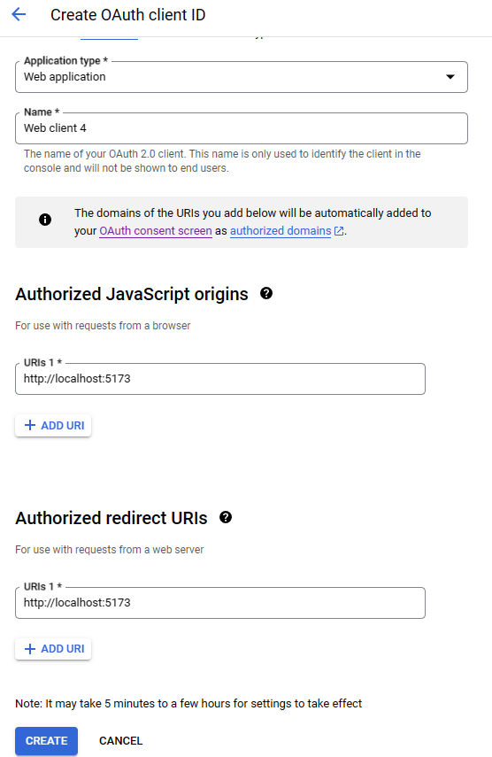

# React + Vite + Express

Minimal setup for a custom A/B testing application using Google Cloud and data from Google Analytics.

## Preview



## Usage

- Select a start date, end date, and metric from the form.
- Click the "Fetch" button to retrieve data from Google Analytics.
- The table will display the data for the selected date range and metric, grouped by country.
- The sum total of the chosen metric is displayed in a separate box.

## Google Cloud + GA Setup

### Google Analytics Property ID:

- Select your project at https://analytics.google.com
- Go to Settings, Property Settings



- You'll see the ID there

### Create Google Cloud Credentials and Enable API (Google Analytics Data API)

- Navigate to API's & Services, Credentials



- Create Credentials (OAuth)



- Enter url's that you're using for your application server (vite uses 5173 by default)



#### Quickstart Guide - https://developers.google.com/analytics/devguides/reporting/data/v1/quickstart-client-libraries#node.js

#### Generate Credentials JSON - https://developers.google.com/workspace/guides/create-credentials#create_credentials_for_a_service_account

## ENV

### Create a .env file in the project root directory and populate it with the following variables:

```
PROPERTY_ID=YOUR_GOOGLE_ANALYTICS_PROPERTY_ID
PORT=3000
VITE_PORT=3000
GOOGLE_APPLICATION_CREDENTIALS_JSON=YOUR_SERVICE_ACCOUNT_KEY_JSON
Replace YOUR_GOOGLE_ANALYTICS_PROPERTY_ID with your Google Analytics property ID, and YOUR_SERVICE_ACCOUNT_KEY_JSON with the contents of your service account key JSON file. Additional VITE_PORT is needed for frontend to contact backend.
```

#### E.g.:

```
PROPERTY_ID=12345678
PORT=3000
VITE_PORT=3000
GOOGLE_APPLICATION_CREDENTIALS_JSON={"type": "service_account", "project_id": "dashboard1-1682805546629", "private_key_id": "blablabla\n-----END PRIVATE KEY-----\n", "client_email": "client-email-here", "client_id": "1234", "auth_uri": "https://accounts.google.com/o/oauth2/auth", "token_uri": "https://oauth2.googleapis.com/token", "auth_provider_x509_cert_url": "https://www.googleapis.com/oauth2/v1/certs", "client_x509_cert_url": "https://www.somelink.com"}
```

### Start the development server:

```
npm start
```

## Contents

#### ExpressJs (Back-end Server) file

```
/api/index.js
```

#### Dashboard (GA data fetch example)

Uses Tailwind instead

```
``Pages``
/src/pages/main/Dashboard.jsx

``Components``
/src/components/Abs/Table.jsx
```

#### AB content

Uses Style Components (Prefered)

```
``Pages``
/src/pages/main/ActiveAb.jsx
/src/pages/main/AllAb.jsx
/src/pages/main/NewAb.jsx

``Components``
/src/components/Abs/AbList.jsx
/src/components/Abs/AbItem.jsx
/src/components/Abs/NewAbForm.jsx

``Context``
/src/setup/ab-context.js
```

#### Unused utility

```
/src/setup/google-analytics.js
```
